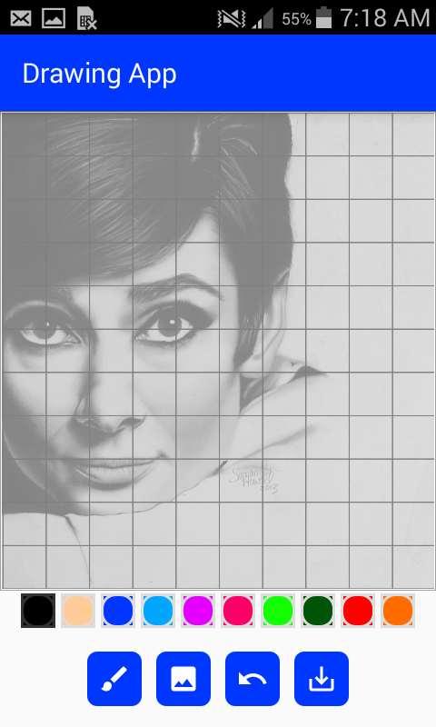

# Drawing_App_Kotlin
My first App using Kotlin, _**Kotlin**_ is Amazing

## Objective 
  * To learn about custom view and And View class in ~~Kotlin~~ (Java).
  * To learn about File Permissions, Read file from Gallery And Write file into the Gallery with proper format and extension.
  * Learn about the **Asynchronous** Task and handling background tasks like importing images and exporting (saving) images.
  * Learn custom dialog and progress bars.

# *Screenshots*

